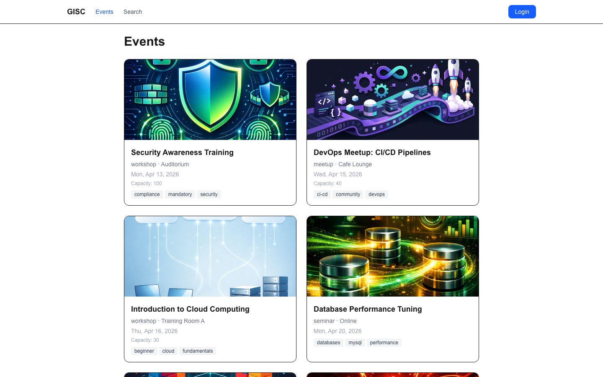
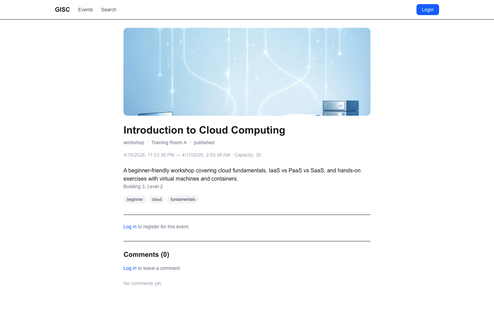
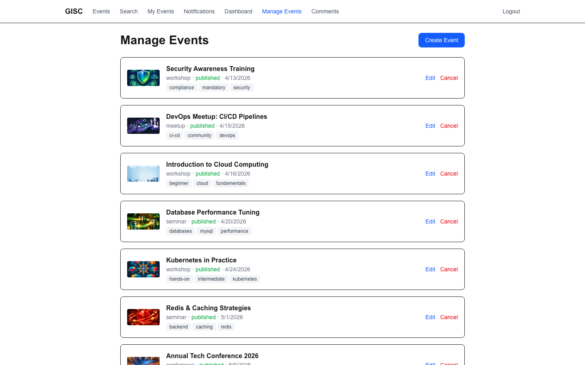
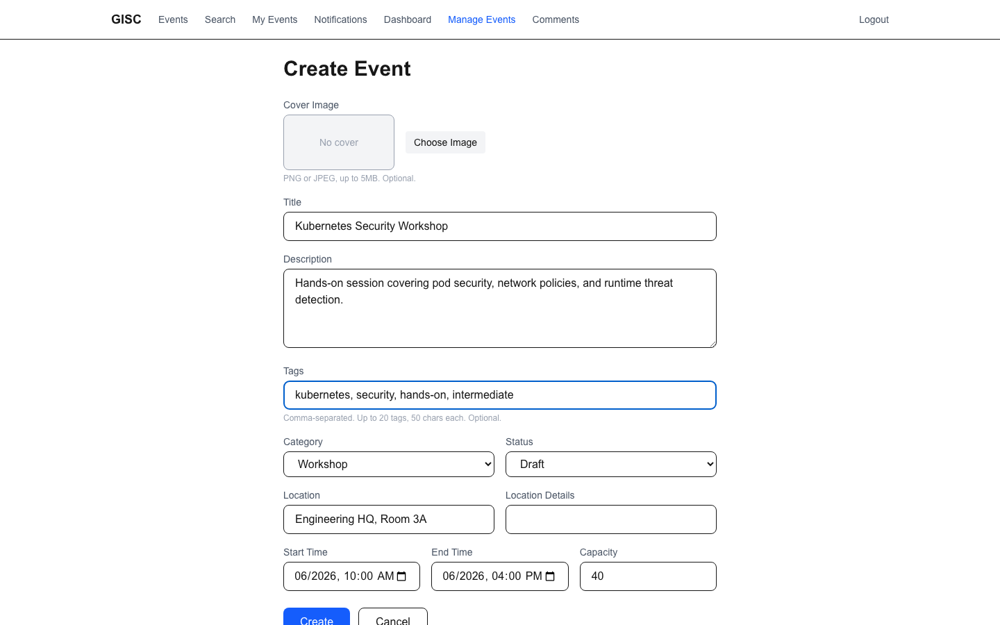
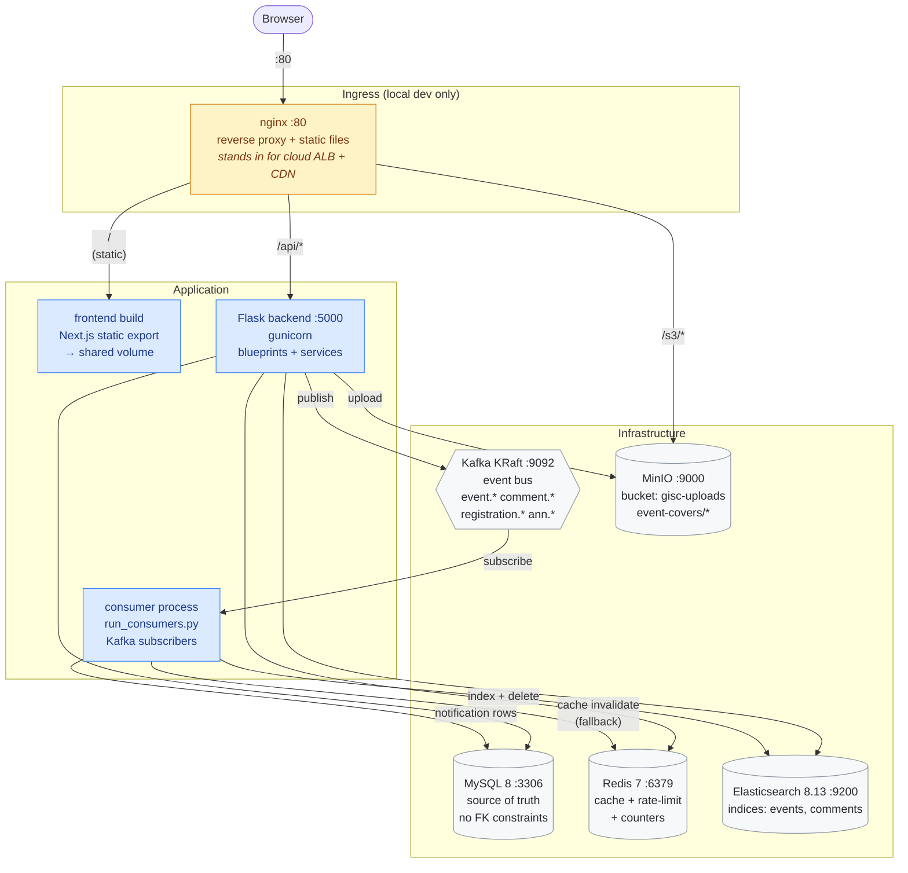
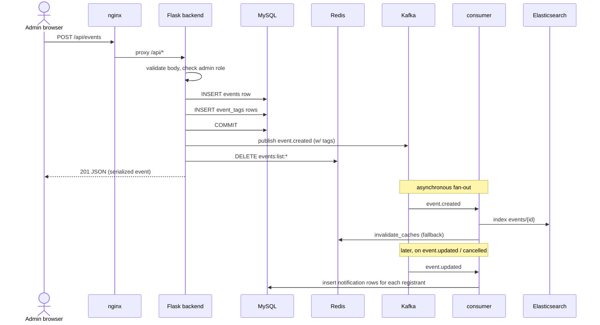

# GISC Demo — Event Management Platform

A full-stack demo that teaches how to deploy a realistic web application to a private cloud. The user-visible surface is a small event management platform — admins create events, users register and comment, everyone gets notified on changes — but the point of the repo is the **full stack of moving parts**: an API server, a separate Kafka consumer process, a relational DB, a cache, a message bus, a search engine, an object store, a reverse proxy, a statically-exported SPA, and an E2E test harness that drives the whole thing.

> This is a **learning resource, not a production application**. The code favours clarity over hardening.

---

## Screenshots

<table>
  <tr>
    <td width="50%">
      <a href="./docs/screenshots/public-events.png">
        
      </a>
      <sub><b>Public events grid</b> — covers, category, location, capacity, and tag chips. Client-rendered from the <code>/api/events</code> listing endpoint (Redis-cached for 60s).</sub>
    </td>
    <td width="50%">
      <a href="./docs/screenshots/event-detail.png">
        
      </a>
      <sub><b>Event detail</b> — single event with cover, metadata, tag chips, login-to-register CTA, and threaded comments (Comments section also shown here empty).</sub>
    </td>
  </tr>
  <tr>
    <td width="50%">
      <a href="./docs/screenshots/admin-events.png">
        
      </a>
      <sub><b>Admin events list</b> — the admin nav is reactive to JWT role via <code>useSyncExternalStore</code>. Each row shows status, start time, and tags; Edit opens an in-place dialog, Cancel soft-cancels via <code>POST /events/&lt;id&gt;/cancel</code>.</sub>
    </td>
    <td width="50%">
      <a href="./docs/screenshots/admin-create.png">
        
      </a>
      <sub><b>Create event form</b> — optional cover image upload (validated client-side for MIME and size) and a comma-separated tags input. Cover is uploaded in a second call after the event is created; partial-failure recovery retries only the upload without creating a duplicate row.</sub>
    </td>
  </tr>
</table>

> Regenerate with `node scripts/take-screenshots.mjs` while the stack is running on `http://localhost`.

---

## Architecture



### Request flow — admin creates an event



The synchronous path returns as soon as MySQL commits and the public-list cache is busted — the client never waits on Kafka, Elasticsearch, or notification fan-out. The asynchronous path handles search index freshness, cross-process cache invalidation as a guaranteed fallback, and per-user notification delivery. If the consumer process is down when an event is published, Kafka buffers the messages; when the consumer comes back up it resumes from its last committed offset.

### Local vs cloud deployment

> ⚠ **nginx and MinIO in this repo are local-dev conveniences only.** They exist so a contributor can `docker compose up` on a laptop and have a working end-to-end environment without touching cloud services. In production they are replaced by managed equivalents.

| Role | Local (this repo) | Production (private cloud) |
|---|---|---|
| HTTPS ingress + API routing (`/api/*`) | `nginx` reverse proxy on `:80` | **Cloud Application Load Balancer** (e.g. AWS ALB / GCP HTTPS LB) with TLS termination, WAF, and path-based routing to the backend target group |
| Static frontend asset delivery | `nginx` serving `frontend/out/` from a shared volume with `Cache-Control: public, immutable` on `/_next/static/` | **Cloud CDN** (e.g. CloudFront / Cloud CDN) fronting the built assets, with geo-distributed edge caching and automatic invalidation on deploy |
| Object storage for event cover images | `minio` container on `:9000` with `./.data/minio` bind mount, proxied via `nginx /s3/*` | **Managed object storage** (e.g. S3 / GCS) accessed via the boto3 client in `StorageService`; the CDN serves images directly from the bucket, so the `/s3/*` rewrite is dropped and image URLs become absolute to the CDN origin |
| Backend / consumer processes | Containers in `docker-compose.yml` | Container orchestrator (ECS, EKS, Cloud Run, etc.) behind the ALB — same images, same env vars, different scheduling |
| MySQL, Redis, Kafka, Elasticsearch | Single-node containers with `./.data/*` bind mounts | Managed equivalents (RDS / ElastiCache / MSK / OpenSearch, or their cloud-neutral counterparts) |

The application code is intentionally agnostic to these differences. `StorageService` talks S3 protocol to both MinIO and real S3. `SearchService` talks to any Elasticsearch-compatible endpoint. The Flask backend reads all connection strings from env vars (`DATABASE_URL`, `REDIS_URL`, `KAFKA_BOOTSTRAP_SERVERS`, `ELASTICSEARCH_URL`, `S3_ENDPOINT_URL`), so switching from `minio:9000` to `s3.amazonaws.com` is purely a configuration change, not a code change. The `/s3/*` nginx rewrite is the only piece that gets removed on the way to production — in the cloud topology, cover image URLs point directly at the CDN.

---

## Services (docker-compose.yml)

All services are declared in `docker-compose.yml`. Application containers (`backend`, `consumer`) depend on infra health checks.

### Infrastructure

| Service | Image | Port(s) | Purpose | Data volume |
|---|---|---|---|---|
| `mysql` | `mysql:8.0` | `3306` | Source of truth for users, events, event_tags, registrations, comments, announcements, notifications. **No FK constraints** — integrity is enforced in the service layer. | `./.data/mysql` |
| `redis` | `redis:7-alpine` | `6379` | Cache for event listings/details, registration counters, rate-limit counters for `Flask-Limiter`. | `./.data/redis` |
| `kafka` | `apache/kafka:3.7.0` | `9092` | Message bus in **KRaft mode** (no ZooKeeper). Single-broker cluster. See [Kafka topics](#kafka-topics). | `./.data/kafka` |
| `elasticsearch` | `docker.elastic.co/elasticsearch/elasticsearch:8.13.0` | `9200` | Full-text search and filtering for events and comments. Single-node, security disabled, Java heap capped at 128 MB to fit on laptops. | `./.data/elasticsearch` |
| `minio` | `minio/minio` | `9000`, `9001` | **Local-dev stand-in for cloud S3.** S3-compatible object store for event cover images; `:9001` is the web console. Bucket `gisc-uploads` is created on first upload with a public read policy. In production, `StorageService` points at real managed object storage (e.g. AWS S3) via the same boto3 client. | `./.data/minio` |

All five share a single `./.data/{service}` bind mount convention — no named Docker volumes, so `docker compose down` preserves everything and `rm -rf .data/` is a full reset.

### Application

| Service | Build | Purpose |
|---|---|---|
| `backend` | `./backend` | Flask HTTP API on `:5000`, served by gunicorn in the container. Handles all synchronous request/response. |
| `consumer` | `./backend` (same image, different entrypoint — `python run_consumers.py`) | Long-running Kafka consumer process. Two subscribers: `indexing_consumer` (ES indexing + cache invalidation fallback) and `notification_consumer` (user notification fan-out). |
| `frontend` | `./frontend` | One-shot Next.js `next build` producing static files. Output is written to a shared `frontend_static` volume. Container exits after build. |
| `nginx` | `nginx:alpine` | **Local-dev only** — stands in for a cloud ALB + CDN. Serves the static frontend, proxies `/api/*` → backend, proxies `/s3/*` → MinIO. In production this role is split across a managed load balancer (for `/api/*`) and a CDN (for static assets). See [Local vs cloud deployment](#local-vs-cloud-deployment). |

---

## Application structure

### Backend (`backend/app/`)

```
app/
├── __init__.py              # app factory, blueprint registration, seed commands
├── wsgi.py                  # gunicorn entrypoint
├── config.py                # env-var config
├── models/                  # SQLAlchemy models (plain Integer refs, no FKs)
│   ├── user.py
│   ├── event.py
│   ├── event_tag.py         # composite PK (event_id, tag), no FK
│   ├── registration.py
│   ├── announcement.py
│   ├── comment.py
│   └── notification.py
├── api/                     # Flask blueprints — one per resource
│   ├── auth.py              #  /api/auth/*
│   ├── events.py            #  /api/events/*   (incl. DELETE for test cleanup)
│   ├── registrations.py
│   ├── announcements.py
│   ├── comments.py
│   ├── notifications.py
│   ├── search.py            #  /api/search/*   (ES-backed)
│   ├── admin.py             #  /api/admin/*
│   └── uploads.py           #  generic /api/uploads/*
├── services/                # business logic — all referential integrity lives here
│   ├── event_service.py     #  + EventTag read/write, bulk tag load, delete cascade
│   ├── registration_service.py
│   ├── comment_service.py
│   ├── notification_service.py
│   ├── cache_service.py     #  Redis wrapper
│   ├── search_service.py    #  ES index management and queries
│   └── storage_service.py   #  MinIO/boto3 wrapper
└── events/                  # Kafka producer + consumer processes
    ├── producer.py
    └── consumers/
        ├── indexing_consumer.py
        └── notification_consumer.py
```

### Frontend (`frontend/src/`)

```
src/
├── app/                              # Next.js App Router
│   ├── layout.tsx                    # root layout (Nav, fonts)
│   ├── page.tsx                      # landing
│   ├── login/page.tsx
│   ├── (public)/                     # unauthenticated routes
│   │   ├── events/page.tsx
│   │   ├── events/detail/page.tsx
│   │   └── search/page.tsx
│   ├── (user)/                       # authenticated-user routes
│   │   ├── layout.tsx                #  ← guard: redirects to /login?next=
│   │   ├── my-events/page.tsx
│   │   └── notifications/page.tsx
│   └── admin/                        # admin routes
│       ├── layout.tsx                #  ← guard: requires role=admin
│       ├── dashboard/page.tsx
│       ├── events/page.tsx           #  list + inline edit dialog
│       ├── events/create/page.tsx
│       └── comments/page.tsx
├── components/
│   └── nav.tsx                       # reactive to auth via useSyncExternalStore
└── lib/
    ├── api.ts                        # typed fetch client, AbortSignal aware, 401-clears token
    └── auth.ts                       # JWT storage, exp check, safeNextPath helper
```

Built as a **static export** (`output: "export"` in `next.config.ts`). All routes are prerendered HTML, hydrated in the browser, and served by nginx. There is no Next.js server at runtime.

### E2E (`e2e/`)

```
e2e/
├── admin-stories.spec.ts   # admin flows; tags fixtures with E2E_TAG
├── user-stories.spec.ts    # user flows
├── helpers.ts              # login helpers, cleanupE2EEvents
└── global-teardown.ts      # end-of-run fallback sweep
```

Tests drive the real `localhost:80` nginx via Playwright. Event fixtures are tagged with `"e2e-test"`; `afterEach` and `globalTeardown` hard-delete them via the admin `DELETE /api/events/<id>` endpoint so the demo DB stays clean.

---

## Data and messaging layout

### MySQL tables

| Table | Purpose | Notable columns |
|---|---|---|
| `users` | Accounts | `id`, `email`, `password_hash`, `role` (`user`/`admin`) |
| `events` | Event catalog | `id`, `status` (enum: draft/published/cancelled/completed), `cover_image` (S3 key), `capacity` |
| `event_tags` | Free-text tags | composite PK `(event_id, tag)`, max 20 tags/event, 50 chars/tag |
| `registrations` | User→event RSVP | unique `(user_id, event_id)`, `status` |
| `comments` | Threaded comments | `parent_id` (self-ref, no FK), `is_hidden` |
| `announcements` | Admin updates per event | `event_id`, `body` |
| `notifications` | Per-user fan-out of interesting events | `user_id`, `type`, `title`, `body`, `is_read` |

**No foreign keys anywhere.** `created_by`, `user_id`, `event_id`, `parent_id` are plain `Integer` columns. The service layer checks existence before writing.

### Redis key patterns

| Key | TTL | Purpose |
|---|---|---|
| `events:list:p{page}:pp{per_page}:cat:{category}` | 60 s | Paginated public event listings |
| `events:detail:{event_id}` | 120 s | Single event payload |
| `events:regcount:{event_id}` | 60 s | Fast counter for "N registered" |
| `dashboard:stats` | varies | Admin dashboard aggregate |
| `LIMITER/*` | - | `Flask-Limiter` rate-limit buckets |

Cache invalidation is triggered directly from the service layer on writes. The `indexing_consumer` also calls `invalidate_caches` as a guaranteed fallback — if the direct call fails or the caller is a different process, Kafka ensures the cache gets busted eventually.

### Kafka topics

| Topic | Published by | Consumed by |
|---|---|---|
| `event.created` | `EventService.create_event` | `indexing_consumer` (→ ES + cache bust) |
| `event.updated` | `EventService.update_event` | `indexing_consumer`, `notification_consumer` (notify registrants) |
| `event.cancelled` | `EventService.cancel_event`, `delete_event` (with `deleted:true` flag) | `indexing_consumer` (delete from ES when flagged), `notification_consumer` |
| `announcement.created` | `AnnouncementService` | `notification_consumer` |
| `comment.created` | `CommentService` | `indexing_consumer` |
| `comment.hidden` | `CommentService` | `indexing_consumer` (updates is_hidden in ES) |
| `registration.created` | `RegistrationService` | `indexing_consumer` (cache bust) |
| `registration.cancelled` | `RegistrationService` | `indexing_consumer` (cache bust) |

Single-partition topics, auto-created on first publish. Consumer group `indexing-consumer` uses earliest-offset auto-commit — a consumer crash replays from the last committed message.

### Elasticsearch indices

| Index | Mapping highlights |
|---|---|
| `events` | `title`/`description`/`location` (text), `category`/`status`/`tags` (keyword), `start_time`/`end_time` (date) |
| `comments` | `body` (text), `user_name` (text + keyword subfield), `is_hidden` (boolean), `event_id` (integer) |

`SearchService.ensure_indices` is idempotent — safe to call on every startup. The `tags` keyword field is added to pre-existing `events` indices via `put_mapping`, so older deployments upgrade in place without a reindex.

### MinIO layout

Single bucket `gisc-uploads` with a public-read bucket policy. Objects live under `event-covers/{uuid}.{ext}`. URLs returned to the frontend are of the form `/s3/gisc-uploads/event-covers/<key>` — nginx rewrites `/s3/` to the MinIO endpoint so the browser never has to know about MinIO directly.

---

## Dependencies

### Backend (`backend/requirements.txt`)

| Package | Role |
|---|---|
| `Flask 3.1` | Web framework |
| `Flask-SQLAlchemy 3.1` / `SQLAlchemy 2.0` | ORM |
| `Flask-Migrate 4.1` | Alembic wrapper (available but currently schema is created via `db.create_all()` through `flask init-db`) |
| `Flask-JWT-Extended 4.7` | JWT auth — `role` claim read by admin guard, signed with `JWT_SECRET_KEY` |
| `Flask-CORS 5.0` | CORS headers for dev |
| `Flask-Limiter 3.8` | Rate limiting (per-IP, Redis-backed) — `/auth/login` capped at 10/min |
| `PyMySQL 1.1` + `cryptography 44` | MySQL driver |
| `redis 5.2` | Cache client |
| `confluent-kafka 2.6` | Kafka producer/consumer |
| `elasticsearch 8.17` | Elasticsearch client |
| `boto3 1.35` | MinIO client (S3 API) |
| `Pillow 11.1` | Cover image resize/compress in the seed script |
| `marshmallow 3.23` | Schema validation helpers |
| `gunicorn 23.0` | Production WSGI server |
| `python-dotenv 1.0` | `.env` loader for local dev |
| `pytest 8.3` + `pytest-cov 6.0` | Backend tests (80 cases, run via `make backend-test`) |

### Frontend (`frontend/package.json`)

| Package | Role |
|---|---|
| `next 16.2` | Static export SPA framework (App Router) |
| `react 19.2` + `react-dom 19.2` | UI runtime |
| `typescript 5` | Type checking |
| `tailwindcss 4` + `@tailwindcss/postcss` | Styling, purge at build |
| `eslint 9` + `eslint-config-next` | Linting |
| `jest 30` + `jest-environment-jsdom` + `ts-jest` | Unit tests (43 cases) |
| `@testing-library/react 16` + `@testing-library/jest-dom` + `@testing-library/user-event` | Component tests |

**Zero runtime dependencies beyond React + Next** — no state-management library, no data-fetching library, no UI kit. The API client and auth store are ~60 lines each in `src/lib/`.

### E2E (root `package.json`)

| Package | Role |
|---|---|
| `@playwright/test 1.59` | Browser automation + test runner. Targets `localhost:80` (the nginx ingress, not the Next dev server). |

---

## Running it

See the `Makefile` for the canonical commands. Common entry points:

```bash
# first-time setup, all via Docker
make docker-up         # bring up infra + backend + consumer + frontend build + nginx
make docker-setup      # init DB, create admin (admin@example.com / admin123), seed 8 events, index ES
                       # then optionally: docker compose exec backend python -m seed_images.upload_covers
                       # to attach DALL-E cover images to the 8 seeded events

# everyday
make docker-up
make test              # backend pytest + frontend jest
make test-e2e          # full Playwright suite against localhost:80
make docker-down

# nuke and pave
make docker-reset      # rm -rf .data/ + docker compose up + docker-setup
```

Local (non-Docker) development is supported too — see `make backend-dev` / `make frontend-dev` — but you'll need MySQL, Redis, Kafka, ES, and MinIO running somewhere reachable.

---

## Conventions worth knowing

- **No foreign keys.** Every `event_id`, `user_id`, `parent_id`, etc. is a plain `Integer` column. Integrity checks live in the service layer. This is deliberate — it's what CLAUDE.md pins as the repo's most important constraint.
- **Frontend is static.** `next build` produces `frontend/out/`, which nginx serves. There is no Next.js server at runtime — no middleware, no route handlers, no server components with dynamic data. All data fetching is client-side through `src/lib/api.ts`.
- **Auth state is reactive without a store library.** `src/lib/auth.ts` dispatches a `gisc:auth-change` event on every token change; `nav.tsx`, the `(user)` layout, and the `admin` layout all subscribe via `useSyncExternalStore`. A 401 from the API client auto-clears the token, which triggers the layout guards to redirect to `/login?next=<path>`.
- **Cache invalidation happens twice.** The service layer bust caches directly for happy-path latency; the `indexing_consumer` also busts them in response to Kafka events as a guaranteed fallback for cross-process writes and failures.
- **Cover images live in MinIO and are proxied by nginx.** The `events.cover_image` column stores the S3 key (e.g. `event-covers/abc.png`); the API serializer turns it into `/s3/gisc-uploads/event-covers/abc.png` on read, and nginx rewrites `/s3/` back to the MinIO endpoint.
- **E2E fixtures tag themselves.** Every test-created event carries the `"e2e-test"` tag, which the `afterEach` and `globalTeardown` use to hard-delete via `DELETE /api/events/<id>`.

---

## Further reading

- [`backend/seed_images/PROMPTS.md`](./backend/seed_images/PROMPTS.md) — DALL-E prompts used for the 8 seeded cover images
- [`Makefile`](./Makefile) — canonical set of commands
